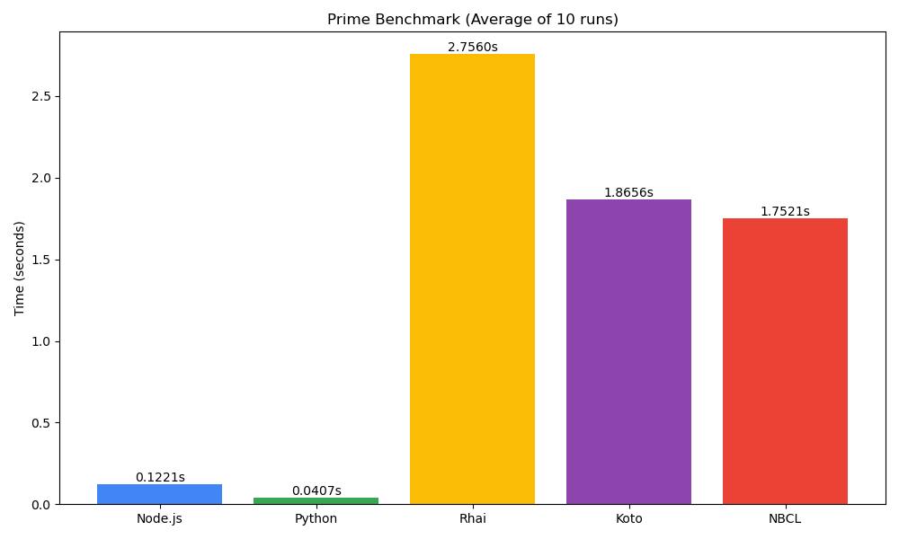

# Benchmarks

This repository is used to benchmark NodeJS, [Python](https://www.python.org/), [rhai](https://rhai.rs), [koto](https://koto.rs), and [NBCL](https://nbcl-lang.github.io).

> [!NOTE] 
> NodeJS and Python are likely to perform badly in tests like this because of their VM startup time and other factors. In long running programs, the cost will go down **significantly** and NodeJS and Python will most likely out perform the other engines.
>
> But, no one is going to write long running programs in these languages. This showcases why they are the best for embedding purposes.

## Running the Benchmark

1. Run `cargo build --release` to compile the nbcl, koto, and rhai launcher.
2. Run `bench.py` to run and generate the results.

## Results

Lower is better in all these scenarios:

### Test: Fibonacci

Find fibonacci of `5000`. This tests all the languages in a tight loop.

### Test: Fizzbuzz

Find fizzbuzz of `5000`. This tests all the languages in a tight loop.

### Test: Prime

Find the `10000` prime number. This is more of a **real-world** test case which is more accurate than Fizzbuzz and Fibonacci. The NodeJS and Python VM's are likely to dominate this test as it is not all about startup time anymore.

## Test: Parse

Finds the fastest parser. This test is mostly oriented towards the Rust engines and tests their startup time. NodeJS and Python are likely to struggle (especially NodeJS because of JIT) because of their massive VM sizes and cost of startup. 

