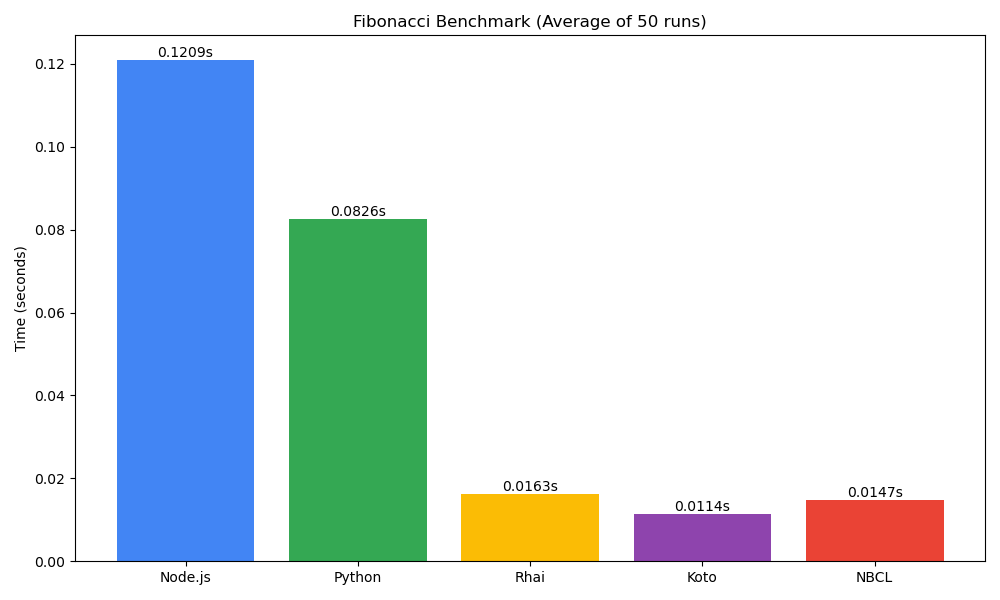
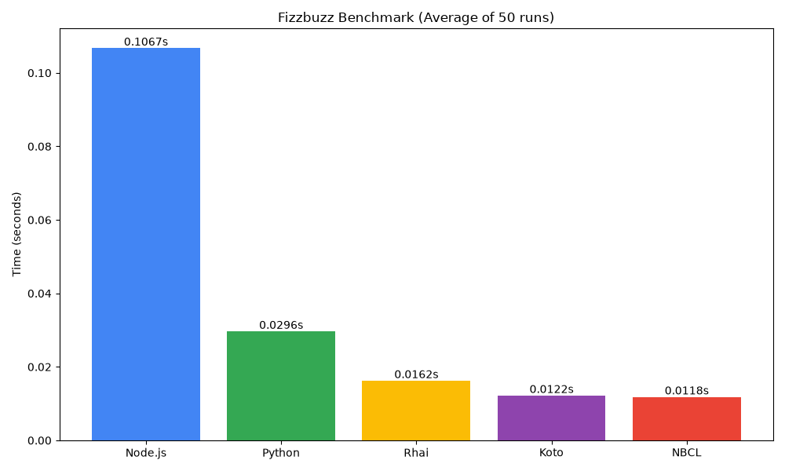
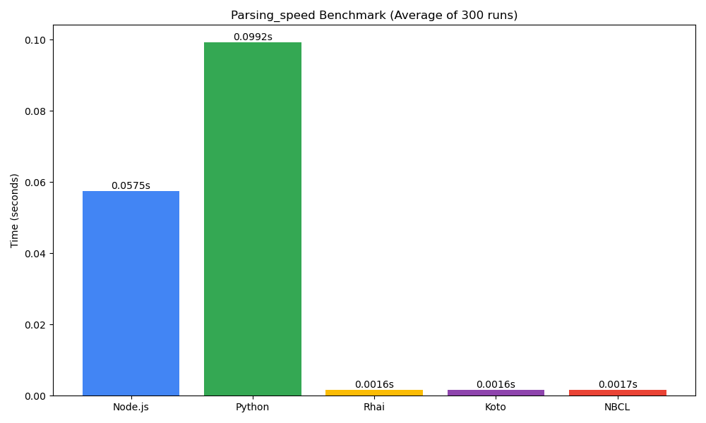

# Benchmarks

This repository is used to benchmark NodeJS, [Python](https://www.python.org/), [rhai](https://rhai.rs), [koto](https://koto.rs), and [NBCL](https://nbcl-lang.github.io).

> [!NOTE] 
> NodeJS and Python are likely to perform badly in tests like this because of their VM startup time and other factors. In long running programs, the cost will go down **significantly** and NodeJS and Python will most likely out perform the other engines.
>
> But, no one is going to write long running programs in these languages. This showcases why they are the best for embedding purposes.

## Running the Benchmark

1. Run `cargo build --release` to compile the nbcl, koto, and rhai launcher.
2. Run `bench.py` to run and generate the results.

## Results

Lower is better in all these scenarios:

